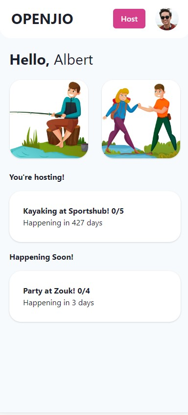

# OpenJio 
A web application with a mobile-first design built with the MERN stack (MongoDB, Express, React and NodeJS) which connects users to host or join activities.

Demo: [openjio.albertdev.xyz](openjio.albertdev.xyz)

## Motivation

Thanks to advancements in technology, it is now easier to communicate with people than ever before. Smartphones, social media platforms, and the internet have made it possible to reach out to anyone, anywhere, at any time. However, despite these convenience, studies have shown that people are feeling more isolated and lonely than ever, with seniors experiencing higher levels of loneliness compared to other age groups. 

I have been wondering what would my parents do after their retirement. I cannot imagine them watching television or scrolling through social media apps for their remaining years. A social app specifically designed for elderly people staying at home could provide a valuable resource for these individuals to connect with others and combat feelings of loneliness and isolation. An easy-to-use app could provide a safe and convenient way for elderly individuals to engage with others and maintain their social connections.

## Main Features
1. Host Activity
    * Fill up the details using a form
2. Dashboard
    * The dashboard allows users to manage listings they have created, as well as the listings they have joined.
    * On the main page, you can view the following
        1. Activities you are hosting
        2. Other Activities that users are hosting
            - Join/Leave: Join the activity
            
            
## Screenshots

